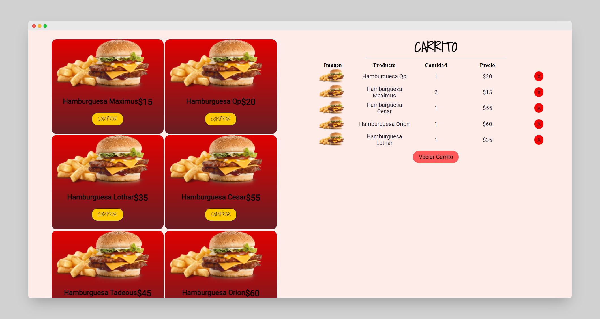

# Shopping Cart Proyect 04 
## Table of contents

- [Overview](#overview)
  - [The challenge](#the-challenge)
  - [Screenshot](#screenshot)
  - [Links](#links)
- [My process](#my-process)
  - [Built with](#built-with)
- [Author](#author)

## Overview

### The challenge

Users should be able to:

- Add products to the shopping cart and delete it.
- Empty shopping cart.
- Add products of the same type.

### Screenshot

### Links

- Live Site URL: [Live Site](https://gonzalogauna-shopping-cart-proyect-04.netlify.app/#)

## My process

### Built with

- Semantic HTML5 markup
- Flexbox
- Grid
- Javascript

## Author

- Twitter - [@gonzalogaunaDev](https://twitter.com/gonzalogaunaDev)
